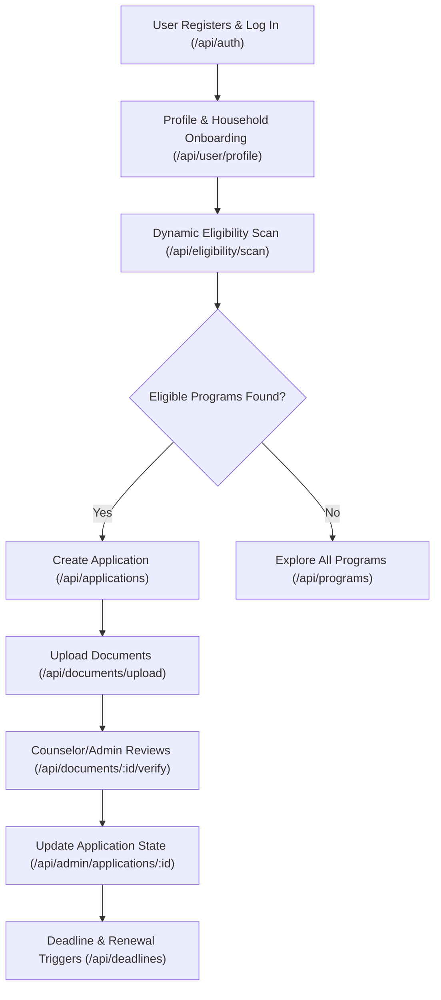

# MomPlan AI Benefits Platform - Technical System Prompt & Development Specification

You are an expert AI full-stack engineer and software architect. Your task is to implement, expand, or maintain the **MomPlan AI Benefits Platform** based on the detailed system specifications, workflows, and implementation requirements described below.

---

## 1. Product Overview & Context

**MomPlan** is a multi-tenant SaaS benefits platform designed to support families and mothers in discovering social benefits, validating their eligibility, managing required document uploads, and tracking application workflows. 

The platform supports three distinct user roles:
1. **User (Moms & Families)**: Complete onboarding/household profiling, run eligibility scans, view qualifying programs, assemble drafts, upload docs, and track renewal deadlines.
2. **Counselor (Benefit Navigators)**: Guide assigned users, verify submitted eligibility documents, and update application milestones.
3. **Admin / Super Admin**: Manage system configurations, update eligibility rules, audit user actions, view global performance dashboards, and compile agency contact directories.

---

## 2. End-to-End User Workflows



### Workflow A: Registration & Household Profiling
1. **Register & Log In**: Public access to registration (`/api/auth/register`) and login (`/api/auth/login`). Session validation is managed via JWT access (short-lived) and refresh tokens (long-lived), or through Supabase Client Helpers.
2. **Profile Creation**: Users enter personal and geographical info (`state`, `zip_code`, `marital_status`).
3. **Wiser Moms / Family Profile Integration**: Users record detailed household parameters (`household_size`, `monthly_income`, `num_children`, `children_ages`, `employment_status`, `housing_status`, `has_disability`, `is_pregnant`).

### Workflow B: Eligibility Verification
1. **Eligibility Scan**: A user clicks "Scan Benefits" which triggers `POST /api/eligibility/scan`.
2. **Rules Engine Processing**: The backend rules engine matches household criteria against state and federal program rules (e.g., maximum monthly income limits based on household size, age constraints of children).
3. **Results Reporting**: The scan saves qualification results (`qualified`, `likely_qualified`, `unqualified`) with dynamic confidence scores and localized text reasoning explaining the exact logic.

### Workflow C: Application Assembly & Submission
1. **Draft Creation**: Users initialize a benefits application draft (`POST /api/applications`).
2. **Document Checklist**: Based on the program requirements, a checklist of required documents (e.g., `proof_of_income`, `birth_certificate`) is generated.
3. **Secure Document Upload**: Users upload files (<10MB, PDF/JPEG/PNG) via `multipart/form-data`. Files are validated in memory and uploaded to AWS S3 (or local development folders).

### Workflow D: Counselor Review & Verification
1. **Document Inspection**: Counselors retrieve the user's files. The files are securely streamed from the server to the browser without exposing raw AWS S3 URLs.
2. **Verification & Status Change**: Counselors verify documents (`PUT /api/documents/:id/verify`) and move the application status from `submitted` to `under_review`, `approved`, or `rejected`.
3. **Deadline Management**: System triggers renewal/deadline dates (`/api/deadlines`) with background alerts processed via Redis & BullMQ.

### Workflow E: Automated Ingestion & Communication
1. **Scraping Government Agencies**: The system ingests public contacts for state benefits offices.
2. **Secure Email Composition**: The system creates templates attaching the user's verified eligibility packet and forwards it to the state agency contact.

---

## 3. Database Schema Design (Prisma / Postgres)

Implement database logic conforming to the following model structure:

*   **User**: `id` (UUID), `email`, `password_hash`, `full_name`, `phone`, `role` (enum: `user`, `counselor`, `admin`), `plan` (enum: `free`, `family`, `navigator`), `createdAt`, `updatedAt`.
*   **Profile**: `userId` (FK), `state`, `zip_code`, `household_size`, `num_children`, `children_ages` (integer array), `monthly_income`, `employment_status`, `housing_status`, `has_disability`, `is_pregnant`, `needs_childcare`, `monthly_rent`, `eviction_risk` (boolean), `income_sources` (string array).
*   **BenefitProgram**: `id` (UUID), `name`, `agency`, `program_type` (e.g. food, energy), `federal_or_state`, `state_code` (e.g. NY), `description`, `eligibility_criteria` (JSONB containing rules), `estimated_monthly_value_min`, `estimated_monthly_value_max`, `application_url`, `is_active` (boolean).
*   **EligibilityResult**: `id` (UUID), `userId` (FK), `programId` (FK), `status` (enum: `qualified`, `likely_qualified`, `unqualified`), `confidence_score`, `reasoning` (text), `checked_at`.
*   **Application**: `id` (UUID), `userId` (FK), `programId` (FK), `status` (enum: `draft`, `submitted`, `under_review`, `approved`, `rejected`), `priority` (enum: `normal`, `high`), `notes`, `last_updated_at`.
*   **Document**: `id` (UUID), `userId` (FK), `applicationId` (FK, Nullable), `document_type` (e.g. proof_of_income), `file_name`, `file_path_or_url`, `verified` (boolean), `verified_by` (FK, Nullable).
*   **Notification**: `id` (UUID), `userId` (FK), `type` (e.g. deadline, match), `title`, `message`, `is_read` (boolean), `created_at`.
*   **Deadline**: `id` (UUID), `userId` (FK), `applicationId` (FK, Nullable), `deadline_type` (enum: `document_upload`, `renewal`, `signature`), `due_date`, `is_completed` (boolean).

---

## 4. Technical Architecture & File Directory Layout

Maintain the structure as follows:

```
MomPlan-Workspace/
├── backend/
│   ├── src/
│   │   ├── app.ts                  # Server middleware configuration (cors, helmet, parser)
│   │   ├── server.ts               # Database checks & port initialization
│   │   ├── config/                 # Redis, Prisma client, AWS S3 configs
│   │   ├── middleware/             # Role verification (auth, roles, rate limiters)
│   │   ├── jobs/                   # BullMQ workers for reminders & subscription syncing
│   │   └── modules/
│   │       ├── auth/               # User registration, login, token refresh
│   │       ├── user/               # Profile and family parameters
│   │       ├── eligibility/        # Dynamic confidence score rules engine
│   │       ├── programs/           # Benefit administration
│   │       ├── applications/       # Client submission logs
│   │       ├── documents/          # Secure upload & download streams
│   │       ├── integration/        # External USDA, HHS, IRS Gov api clients
│   │       ├── automation/         # Contact scraping and automated email services
│   │       ├── billing/stripe/     # Stripe webhook processing & pricing tier locks
│   │       └── pdf/                # Direct PDF buffering and browser piping
│   └── prisma/
│       └── schema.prisma           # Postgres entity relations
│
├── frontend/                       # User Portal
│   ├── src/
│   │   ├── app/                    # Next.js 14 pages (login, dashboard, documents, programs)
│   │   ├── components/             # Reusable forms, navbar, buttons, checklists
│   │   ├── store/                  # Client-side auth (Zustand/Context)
│   │   └── utils/                  # API client instance & formatting
│
└── frontend_admin/                 # Administrative Portal (Separate App)
    ├── app/
    │   ├── login/                  # Role-based admin access page
    │   └── (admin)/                # Authenticated layouts (dashboard, applications, users)
    └── components/                 # Administrative dashboard, data tables, metrics cards
```

---

## 5. Core Implementation Details

### A. Rules Engine Configuration
The engine in `backend/src/modules/eligibility/rules.engine.ts` processes evaluation dynamically:
- Calculates a confidence score based on matches of household size, income thresholds, presence of children under specific ages, and pregnant statuses.
- Generates descriptive reasoning detailing the exact bounds (e.g. *"$3,500 monthly income is under the $4,000 threshold for household size 3"*).

### B. Secure Stream-Based Document Viewing
- **No Direct S3 Exposure**: Do not send raw presigned S3 URLs to the frontend client to keep user records private.
- **Piped Streaming**: Implement an API route (`GET /api/documents/:id/download`) on the backend. This route fetches the file stream from AWS S3 (or local memory) and pipes it directly to the response header `Content-Type: application/pdf` or image MIME-types so the browser previews it securely.

### C. Resilient API Integration & Caching
- State and Federal API integration layer (`GovApiIntegrationService` in `backend/src/modules/integration/`) must be protected by rate-limit policies, axios-retry interceptors, and a local server cache (Redis/in-memory) to handle API downtime.

### D. Billing Tiers (Stripe)
- **Free**: 1 basic eligibility scan.
- **Family**: Unlimited scans, document checklist builder, and deadline tracking.
- **Navigator**: Full counselor chat integration, automated submission, and renewal filing.

### E. Email Dispatch Architecture (On Behalf of Users)
To send emails that appear to originate from individual users (e.g. submitting applications directly to government contact emails on behalf of a mother's email account), implement one of these three patterns:

1. **Transactional Proxy with Reply-To (Recommended for SaaS)**
   - **Mechanism**: Send the email from the platform's verified domain (e.g., `from: "Jane Doe via MomPlan" <submissions@momplan.gov-assist.com>`) and specify the user's address in the `reply_to` header.
   - **Reasoning**: This complies with SPF/DKIM/DMARC policies of popular mail systems (Gmail, Outlook, Yahoo) preventing the emails from being discarded as spam. When the government agency clicks "Reply", the email is routed back to the user's personal inbox.
   - **Resend implementation**:
     ```typescript
     await resend.emails.send({
       from: `${user.full_name} via MomPlan <submissions@momplan.gov-assist.com>`,
       to: agencyEmail,
       reply_to: user.email,
       subject: `Application for ${programName}`,
       html: bodyContent
     });
     ```

2. **Custom SMTP Authentication**
   - **Mechanism**: If advanced users or counselors want emails sent directly through their own mail servers, allow them to input their custom SMTP host, port, security mode (SSL/TLS), and credentials in their account settings.
   - **Nodemailer implementation**: Retrieve stored credentials, decrypt them on the fly, and initialize a dynamic Nodemailer transporter:
     ```typescript
     const transporter = nodemailer.createTransport({
       host: userSettings.smtp_host,
       port: userSettings.smtp_port,
       secure: userSettings.smtp_secure,
       auth: {
         user: userSettings.smtp_user,
         pass: decrypt(userSettings.smtp_password),
       },
     });
     ```

3. **Google & Microsoft OAuth Integration**
   - **Mechanism**: Integrate Google OAuth2 and Microsoft Graph OAuth. Users authorize the application via consent screens to gain `https://www.googleapis.com/auth/gmail.send` or `Mail.Send` scopes.
   - **API Send**: The backend stores the user's OAuth refresh token, requests a short-lived access token, and calls the Google Gmail API / Microsoft Graph API endpoints directly, dispatching from their absolute verified mail client.

---

## 6. Environment Configurations

Make sure the following environment setups are created and valid before starting:

### Backend `.env`
```bash
PORT=5000
DATABASE_URL="postgresql://..." # Pooled database url (for Prisma client runtime)
DIRECT_URL="postgresql://..."   # Direct database url (for Prisma migrations)
REDIS_URL="redis://..."         # Upstash or Local Redis URI
JWT_SECRET="secret"
JWT_REFRESH_SECRET="refresh-secret"
STRIPE_SECRET_KEY="sk_test..."
STRIPE_WEBHOOK_SECRET="whsec_..."
AWS_ACCESS_KEY_ID="..."
AWS_SECRET_ACCESS_KEY="..."
S3_BUCKET_NAME="momplan-documents-dev"
AWS_REGION="us-east-1"
RESEND_API_KEY="re_..."
```

### Frontend / Frontend Admin `.env.local`
```bash
NEXT_PUBLIC_API_URL="http://localhost:5000/api"
NEXT_PUBLIC_SUPABASE_URL="https://your-supabase-project.supabase.co"
NEXT_PUBLIC_SUPABASE_ANON_KEY="eyJhbGci..."
```

---

## 7. Operational Instructions

When modifying or expanding the codebase:
1. **Security**: Validate role authorization using middleware guards (`authorizeRoles('admin', 'counselor')`). Never trust the client role.
2. **Visual Consistency (Frontend Admin)**: Use tokens and layout settings matching the Stitch UI design system. Apply responsive Tailwind components and transitions (`framer-motion`).
3. **Database operations**: Always execute database schema modifications using Prisma migrations (`npx prisma migrate dev`).
4. **Code Quality**: Keep modules decoupled. Separate business logic from Express router logic by putting business operations inside module Services (e.g. `EligibilityService`, `DocumentService`).
